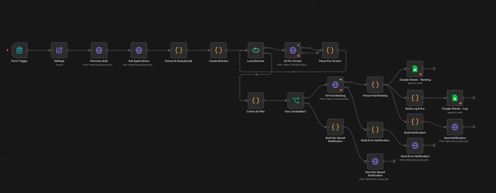

# AI Recruiter Assistant

An n8n workflow that does first-pass CV screening with a two-stage LLM pipeline. You give it a job description, it pulls the applicants from Personio, scores and ranks them, and writes a shortlist to Google Sheets with the reasoning attached. It's a triage tool, not a decision-maker — more on that below.

## The problem it solves

High-volume roles — interns, working students, technical specialists — pull in a few hundred applications each. Reading them by hand is slow (a couple of minutes per CV adds up to most of a working week per role), and honestly it gets less consistent the further you go. Nobody screens the 200th CV with the same attention as the 5th. The point of this workflow is to take the obvious-no pile off a recruiter's desk so the human time goes to the candidates who are actually worth a closer look.

I didn't want a keyword matcher — that's what most ATS scoring already does, and it's shallow. I wanted something that reads a CV against the actual job description and explains its call.

## How it works

A form kicks it off: you enter the job title, the JD text, a minimum score, and how many top candidates you want. From there it authenticates with Personio, pulls the applications, deduplicates (people apply to more than one opening), and splits everything into batches so large volumes don't blow up the API calls.

Then comes the two-stage part, which is the whole idea:

- **Stage one** is a cheap, fast pass over every candidate — a broad filter that throws out the clear mismatches.
- **Stage two** is a slower, more expensive ranking that only runs on whoever survived stage one, and produces the actual ordered shortlist with a rationale for each.

Running the expensive model on everyone would have worked too, but it was wasteful — most of the spend was being burned on candidates that were never going to make the cut. Splitting it into a cheap filter and a deep ranking is where the cost savings come from; in practice the two-stage setup runs at roughly a third of what a single deep pass cost, since most CVs never reach stage two.

Output goes to two Google Sheets — the ranking itself, and a separate activity log of every run. Notifications cover three cases: it worked, it errored, or it found nobody above threshold. That last one mattered to me — a recruiter should never be left wondering whether the thing ran and found nothing, or just broke.

## Architecture



```
Form trigger (JD, min_score, top_n)
        │
   Settings (parametrise the run)
        │
   Personio auth → get applications
        │
   Extract + deduplicate
        │
   Create batches
        │
   ┌─ loop batches ─┐
   │  AI pre-screen │   stage 1 — cheap, broad filter
   │  parse + filter│
   └───────┬────────┘
           │
   Any candidates left? ──no──→ "no result" notification
           │ yes
   AI final ranking          stage 2 — deep, ranked, with rationale
           │
   parse ranking
           ├──→ Google Sheets (ranking)
           ├──→ Google Sheets (activity log)
           └──→ notification (success / error branches)
```

## Stack

n8n for orchestration, triggered by its built-in form node. Personio REST API for the applicant data, an LLM API (works with OpenAI or Anthropic — it's configurable) for the scoring, Google Sheets for output and logging, and Microsoft Graph for the notifications.

## Why it's on version 4

The first version was naive and I kept hitting real-world edge cases that broke it. Malformed CVs that didn't parse. API timeouts on the bigger requisitions, which is what pushed me to add batching. Empty result sets that the workflow didn't handle gracefully and just looked broken. Each version fixed a class of problem the previous one tripped over. The thresholds (`min_score`, `top_n`) became configurable somewhere around version 3, once I got tired of editing the workflow itself every time a role had different needs.

I also ran the scoring logic past a few different models while building it, comparing how they ranked the same candidate pool — partly to sanity-check that the output wasn't just one model's quirk, partly to tune the prompts. That cross-checking is a big part of why I trust the version that's here.

## Honest limitations

This screens, it doesn't decide. LLM scoring always needs a human in the loop before any actual hiring call — the workflow is built to narrow the pile, not to pick the winner.

On bias: the prompts need auditing for proxy bias on protected attributes, regularly, not once. The activity log exists partly so that's even possible after the fact.

On GDPR: candidate data goes through a third-party LLM API, so a DPA needs to be in place before this runs on real data. That's not optional and it's the first thing to sort out before deploying anything like this.

## Running it yourself

1. Import `workflow.json` into n8n.
2. Add credentials: Personio, your LLM API, Google Sheets OAuth2, Microsoft Graph.
3. Set up the form fields (job title, JD, min score, top N).
4. Create the two target Google Sheets.
5. Adapt the prompts in the AI nodes to your own criteria and tone — this is the part that actually matters, the rest is plumbing.

## Note

Sanitised version of a real system. Prompts, business logic and endpoints have been generalised; the architecture and the reasoning behind it are the real thing.
