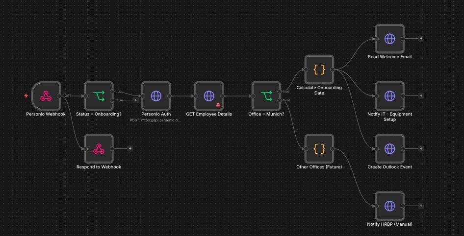

# Onboarding Wizard

A production-ready n8n workflow that automates new-hire onboarding processes triggered by Personio HRIS status changes.

## Problem

Manual employee onboarding creates friction across HR, IT, and management:
- HR manually sends welcome emails to new hires
- IT learns about new equipment requests via informal channels (delayed setup)
- Calendar events for first-day orientation are forgotten or scheduled late
- HR Business Partners lose visibility on onboarding pipeline status

This results in inconsistent new-hire experience, IT setup delays, and HR overhead.

## Solution

A webhook-triggered automation that fires when a Personio employee enters "Onboarding" status. The system:

1. Authenticates with Personio API and pulls full employee details
2. Routes by office location (currently Munich-pilot, with extensibility for additional offices)
3. Calculates onboarding milestone dates
4. Sends a personalized welcome email to the new hire
5. Notifies IT for equipment provisioning
6. Creates an Outlook calendar event for first-day orientation
7. Falls back to manual HRBP notification for unsupported offices

## Architecture


```
Personio Webhook (status change)
    ↓
Status = "Onboarding"? ──No──→ End
    ↓ Yes
Personio Auth + GET Employee Details
    ↓
Office = Munich? ──No──→ Notify HRBP (manual fallback)
    ↓ Yes
Calculate Onboarding Date
    ↓
    ├──→ Send Welcome Email (to new hire)
    ├──→ Notify IT (equipment setup)
    └──→ Create Outlook Calendar Event
```

## Tech Stack

| Component | Technology |
|-----------|-----------|
| Orchestration | n8n |
| HRIS API | Personio REST API |
| Email + Calendar | Microsoft Graph API (OAuth2) |
| Auth | Bearer token (Personio), OAuth2 (Microsoft) |
| Custom logic | n8n Code nodes (JavaScript) |

## Implementation Highlights

- **Webhook-driven, event-based architecture** — no polling, no cron, fires within seconds of status change
- **Office-based routing logic** — Munich-pilot ready, with explicit fallback path for offices not yet supported
- **Authentication abstraction** — Personio auth handled in a dedicated node for reusability
- **Bilingual templates** (German + English) prepared for international hires
- **Manual fallback** for edge cases — never silently fails, always notifies a human

## File

- [`workflow.json`](./workflow.json) — Importable n8n workflow definition

## Setup (if you want to adapt this)

1. Import `workflow.json` into your n8n instance
2. Configure credentials: Personio API key, Microsoft Graph OAuth2
3. Replace placeholder office names with your actual office identifiers
4. Adapt email templates to your company branding
5. Update environment variables for `OUTLOOK_SENDER_EMAIL` and similar

## Notes

This is a **sanitized version**. Endpoints, email templates, office names, and business logic have been generalized. The original was deployed as the standard onboarding flow for the Munich office of an enterprise client.
